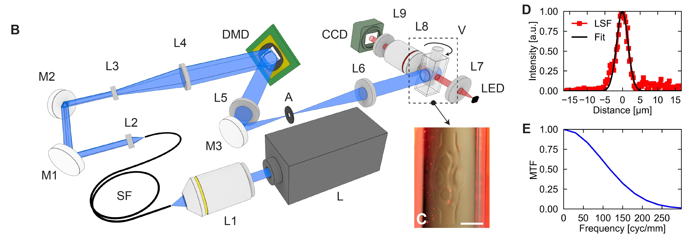
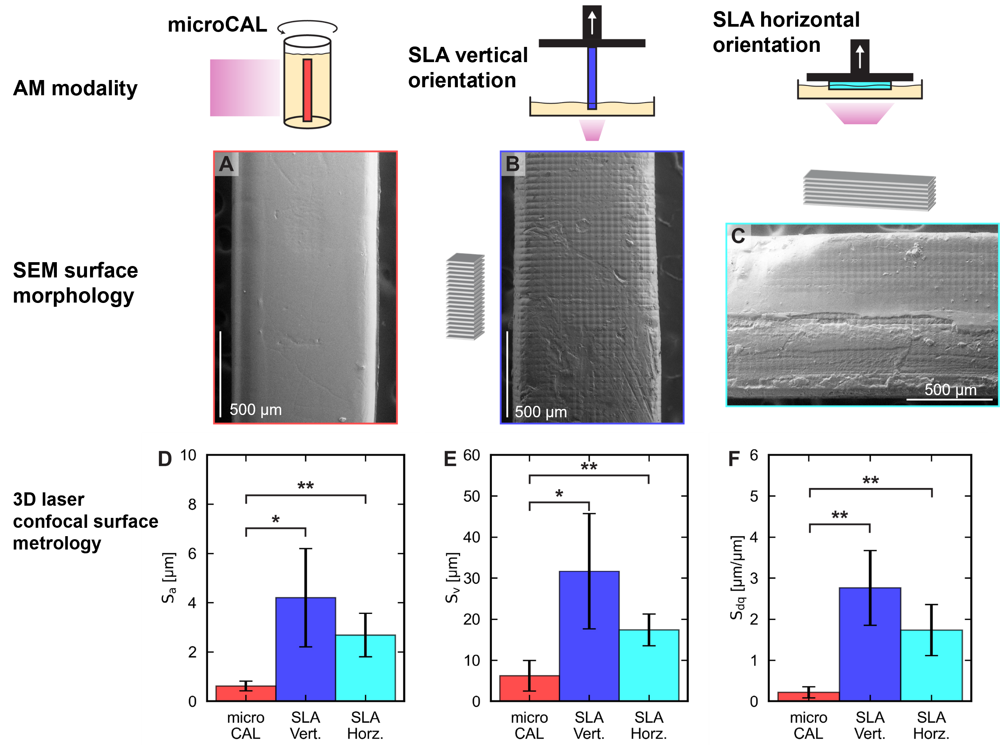
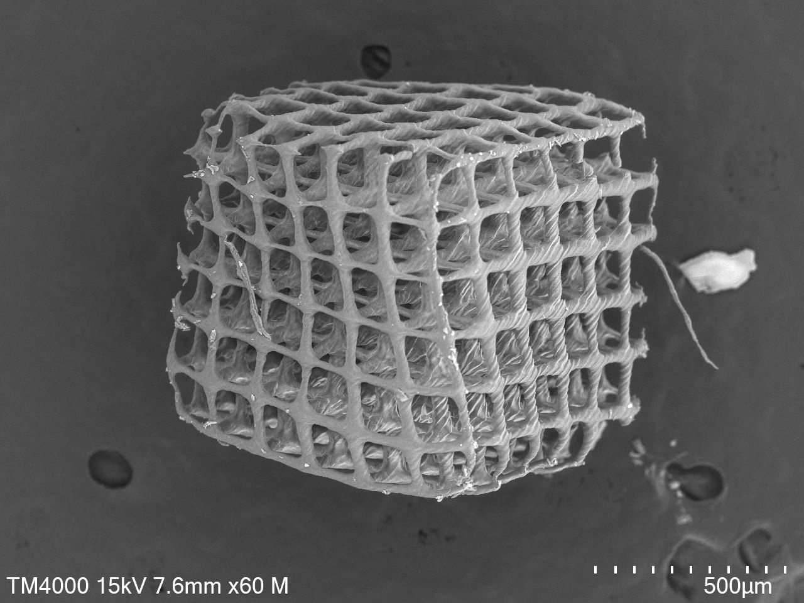
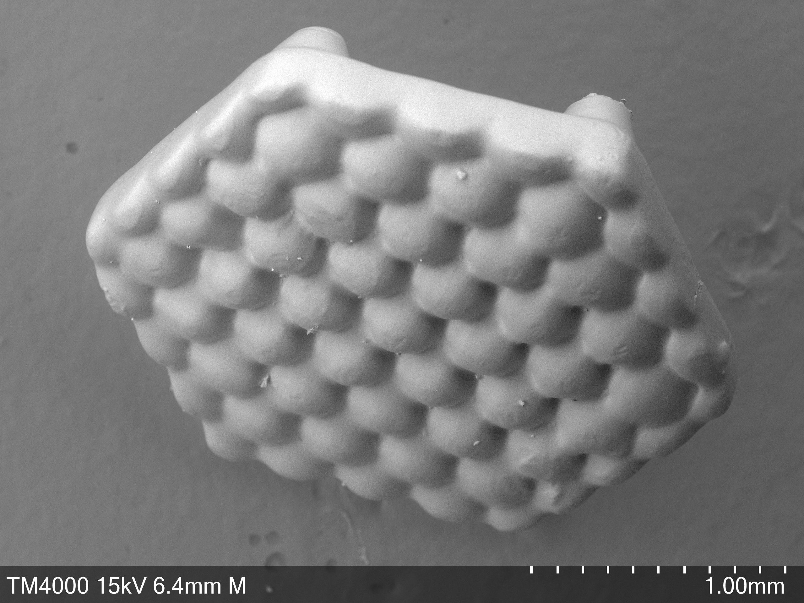
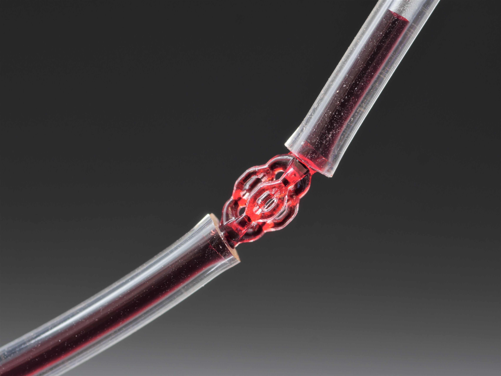

## Micro computed axial lithography (MicroCAL)

MicroCAL is a light-based 3D printing based on the tomographic exposure principles of CAL. 

### Optical layout

The MicroCAL has a custom laser-based optical system. A diode laser is launched into an optical fiber to homogenize the output irradiance profile. The fiber is collimated and expanded. The beam is directed onto the digital micromirror device (DMD). The digital mask is imaged into a rotating vial of photosensitive material. The digital projection images are refreshed in sync with the rotation of the material. The point spread function (PSF) width was measured by projecting a mask of an edge, capturing images of the edge with a CMOS sensor, and using a supersampling algorithm. The PSF was about 4 µm full-width half-maximum. 

### Roughness

In this study, a nanocomposite resin was used. The nanocomposite composes spherical silica nanoparticles and a monomer binder. The binder is burnt out in a thermal treatment process after printing is completed. The roughness of rectangular beams printed by microCAL and other layer-based printing methods was measured and compared. In metrics: arithmetic mean surface roughness, valley height, and surface gradients, MicroCAL showed the smallest magnitude. 

### Printing

Coordination of the rotation stage and DMD is done with a custom Python software running on a PC. The laser is controlled by a microcontroller which is controlled by the PC via serial communication. Prints require approximately 45-90 seconds of exposure time. Polymeric and silica glass parts were printed with minimum feature sizes of 20 and 50 µm.

