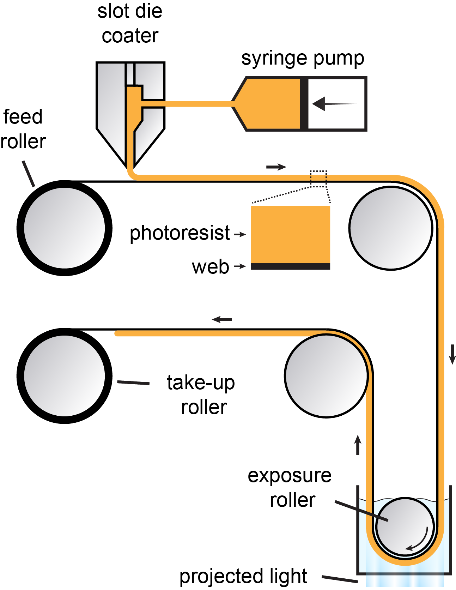

## Roll-to-roll computed axial lithography (R2R CAL)

R2R CAL is a new form of continuous light-based 3D printing based on the tomographic exposure principles of CAL. 

### Optical layout

There are some notable differences in the optics for CAL and R2R CAL. First, the object to be printed lies near the edge of the rotating body instead of near the rotation axis in conventional CAL. To achieve the best printing resolution and uniform point spread function (PSF) over the printing region, this requires a long focal depth that covers the entire distance the photoresist traverses in the y-axis (see axes definition in the layout below). However, to achieve this with a static optical system, the numerical aperture must be decreased and, consequently, the PSF size increases. Since we would like to print microstructures this is undesirable, so we use an electrically tunable lens (ETL) to instead shift the focal plane dynamically. The ETL is sychronized to the digital micromirror device (DMD) such that segmented images are projected onto corresponding focal planes to follow the curvature of the photoresist.

### Material handling and systems

The R2R line is driven by a servo motor and constant tension is provided by an AC torque motor. [Gel photoresist](https://josephtoombs.netlify.app/publication/content/publication/toombs-2023/) is dispensed onto the web in a 1-3 mm thick coating with a heated slot-die coater and syringe pump. The exposure roller supports the substrate and photoresist where the digital light patterns are projected.

High-level coordination of mechanical, material coating, and optical subsystems is done with a custom Python software running on a PC. Each subsystem is controlled at low level with microcontrollers and signals are passed from the PC to microcontrollers via serial communication. 

